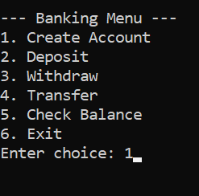
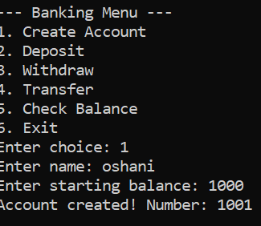
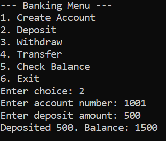
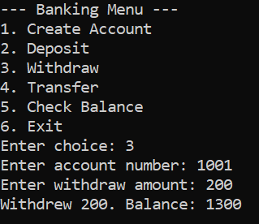
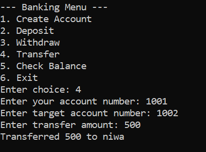
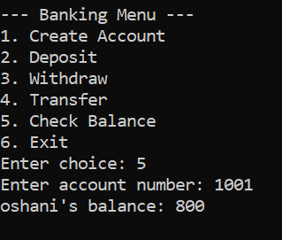
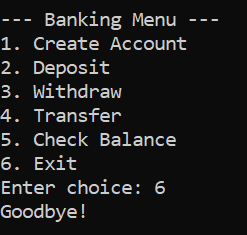

A simple C++ banking system project that allows users to create accounts, deposit money, withdraw funds, transfer between accounts, and check balances. Designed as a beginner-friendly console application to demonstrate basic object-oriented programming concepts.

 ## Screenshots

### Main Menu

### Create Account

### Deposit

### Withdraw

### Transfer

### Check Balance

### Exit

